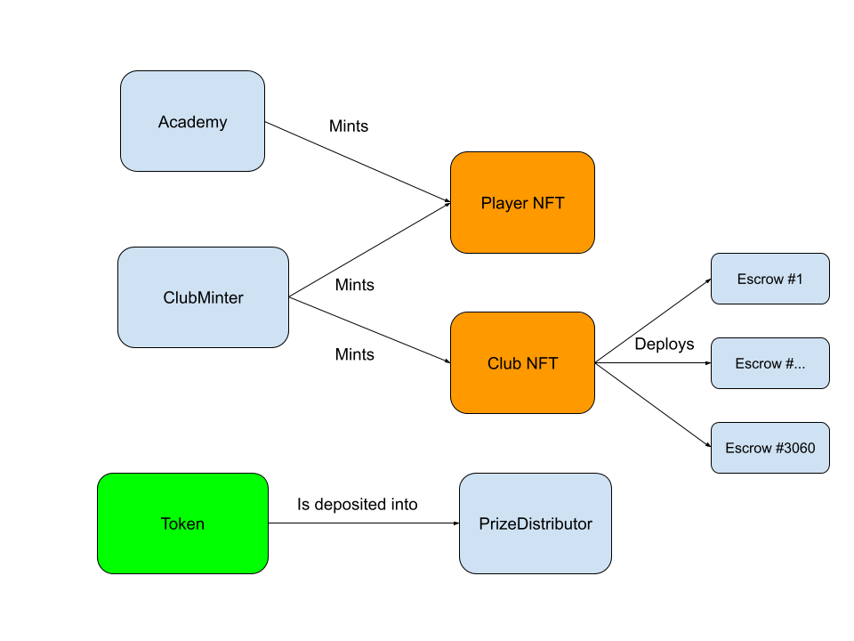
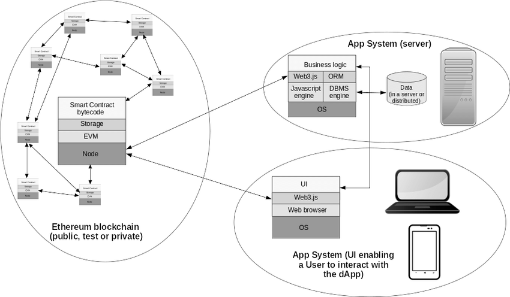

## Overview

The full Footium game has multiple interacting smart contracts. The contract
repository is called `footium-eth` and uses the popular Hardhat framework.

The smart contracts are written in Solidity. The tests and helper scripts are
written in TypeScript. The `package.json` file has commands to start a local
blockchain and run helper scripts, like deployment and token minting.

## Introduction

Footium uses smart contracts to track players assets, such as player and club
NFT's, and tokens like Footium Token. Only the football club NFT's are live on
mainnet currently, but the other contracts have been written and were deployed
in each testnet beta.

### Our contracts

The Footium smart contracts track Player and Club NFT's, the Footium Token
token, and handle prize distribution. Here's a rough diagram of our smart
contracts and (mostly) how they interact:

Footium has 8 smart contracts.

- [FootiumAcademy.sol](./FootiumAcademy.md)
- [FootiumClub.sol](./FootiumClub.md)
- [FootiumClubMinter.sol](./FootiumClubMinter.md)
- [FootiumEscrow.sol](./FootiumEscrow.md)
- [FootiumGeneralPaymentContract.sol](./FootiumGeneralPaymentContract.md)
- [FootiumPlayer.sol](./FootiumPlayer.md)
- [FootiumPrizeDistributor.sol](./FootiumPrizeDistributor.md)
- [FootiumToken.sol](./FootiumToken.md)

### Tests

Tests written in TypeScript can be found in the `./test` directory. We also have
an `e2e.ts` file which demonstrates and tests end-to-end user usage of the smart
contracts.

### Note: The Blockchain-API-Frontend triarchy

On a high level, the `footium-node` indexer, frontend, and blockchain in all
interact in cyclical fashion. Events emitted by the blockchain are indexed by
the API. This in turns updates the information displayed on the frontend.
Finally, users act on this information and execute blockchain transactions,
mediated via the frontend. Here's an overcomplicated diagram:

### Scripts

There are 5 helper scripts:

`mint-club.ts` mints an individual club to the account and token ID that you
specify.

`mint-clubs.ts` mints all of the clubs specified in your local Footium
`config.json`. This is useful for setting up a testing environment based on a
live or beta deployment.

`mint-token.ts` mint an `FootiumToken` tokens to the account and with the amount
that you specify.

`mint-tokens.ts` mints `FootiumToken` tokens to the clubs specified in your
local `config.json`.

`set-prize-merkle-root.ts` sets the merkle root on the `FootiumPrizeDistributor`
contract to the bytes of your choice. We use this when reading the prizes owned
to each player from our database, converting them to a merkle root, then
allowing users to claim.

## Extras

### Prize pools

The Footium prize pool system allows clubs to claim ERC20 tokens based on their
league performance. Prize pools are currently funded by player trading fees but
anyone can send tokens to the prize distributor contract.

The smart contracts, API, and frontend all fill a crucial role in this system.

### Contracts

The `FootiumPrizeDistributor` contract allows a privileged actor (the game
developers) to set a merkle root which encodes all the prize data. There is also
a function for users to claim tokens.

### API

The API monitors prize pool balances by indexing the blockchain. It also adds
`prize` entries to the database whenever a tournament finishes. It provides two
API endpoints. The first loops through all prizes in the DB and generates a
merkle root that we can then manually set in the smart contract. The second
supplies a merkle proof to the users when they claim tokens.

### Frontend

The frontend assists users in claiming their token prizes, via the
[rewards](https://gitlab.com/simium/footium/-/blob/master/packages/footium-frontend/src/components/clubDetail/ClubRewards.tsx)
tab on the clubs page. When a user clicks claim, the frontend attempts to fetch
a merkle proof from the API's `prizeMerkleProof` endpoint for the relevant Club
ID and Token ID.

With this proof, it then uses our
[EthereumProvider](https://gitlab.com/simium/footium/-/blob/master/packages/footium-frontend/src/components/providers/EthereumProvider.ts)
with ethers.js to call the `claim` function on the `FootiumPrizeDistributor`
contract.

## Escrow contracts

Much like real world football clubs, Footium clubs have their own "inventories"
which can hold ERC20 tokens and ERC721 NFT's. The owner of the club can control
these assets, and in future they will be able to grant access to assistant
managers too.

To ensure compatibility with 3rd party services, each club must have its own
unique address to receive assets to. We achieve this by deploying a
`FootiumEscrow` contract for each club.

`FootiumEscrow` has four state-changing functions: two for transferring ERC20
and ERC721 tokens, and two for [setting
approval](https://stackoverflow.com/questions/70672642/whats-the-purpose-of-the-approve-function-in-erc-20)
for these tokens. Each of these functions require that the caller is the owner
of the club.

Without the token approvals, the club cannot buy or sell players. These can be
set via the Footium frontend.

`FootiumEscrow` follows the [EIP1271
standard](https://eips.ethereum.org/EIPS/eip-1271). As smart contracts cannot
sign messages themselves, EIP1271 allows contracts to define which EOA
signatures are considered valid (more on Ethereum accounts
[here](https://ethereum.org/en/developers/docs/accounts/)). In our escrow
contract, only signatures signed by the club owner are considered valid.
Ultimately, this allows our escrows to interact use NFT marketplaces like the
Rarible Protocol, as specified
[here](https://github.com/rarible/protocol-contracts/blob/master/exchange-v2/contracts/OrderValidator.md).

## Football Club NFT's

The Footium Football Club NFT's live on Ethereum mainnet and follow the
[ERC721](https://docs.openzeppelin.com/contracts/3.x/erc721#:\~:text=ERC721%20is%20a%20standard%20for,across%20a%20number%20of%20contracts.)
standard. The mint took place in November 2021 with an initial supply of 3060
clubs.

Each NFT has a randomly generated name, badge lore, and stadium layout. This
metadata can be fetched by following the link provided by the smart contract's
`tokenURI` function, which (at the time of writing) points to our API. Try it
[here](https://etherscan.io/address/0x659cf1306edba213d1fb8f9352b4593a82b05d0c#readContract#F17)!

The Football Club contract can be viewed here:
https://etherscan.io/address/0x659cf1306edba213d1fb8f9352b4593a82b05d0c

The clubs were minted from specialised minter contract:
https://etherscan.io/address/0xc71b9ff588323a7f52c9f91130f397036bd0a508
